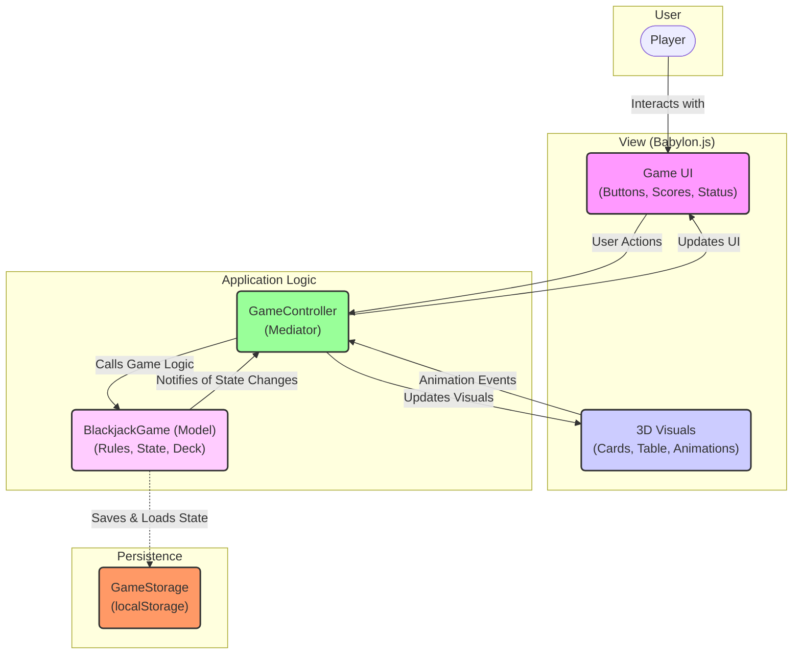
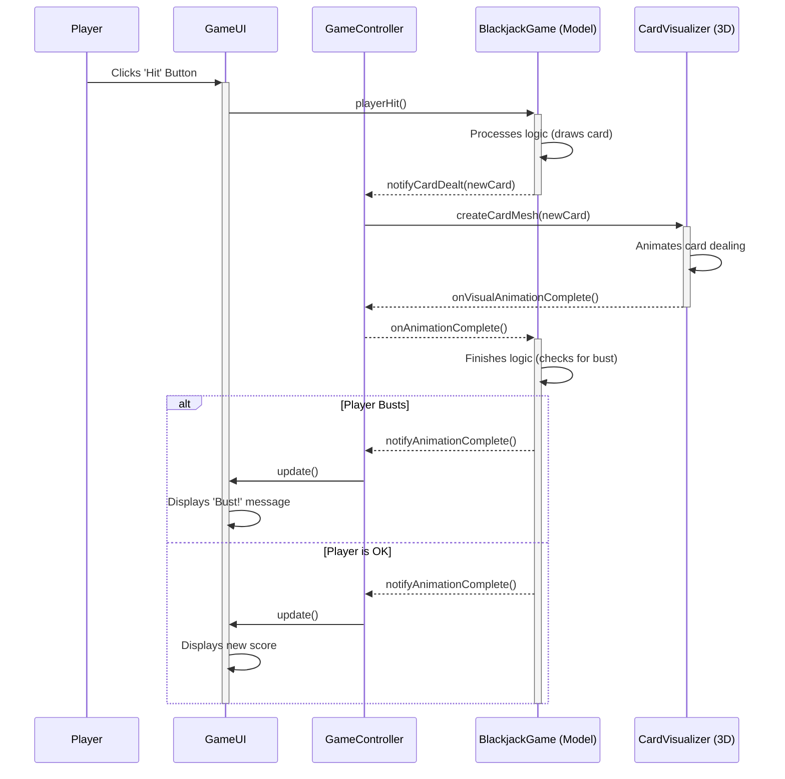

# Damn Simple Blackjack

**A modern, 3D Blackjack game built with TypeScript and Babylon.js.**


*(Screenshot placeholder)*

This project is a fully-featured Blackjack game rendered in a 3D environment. It demonstrates a clean separation between core game logic and visual presentation, using Babylon.js for rendering and UI, and pure TypeScript for the game rules and state management.

---

## ✨ Features

*   **Full 3D Gameplay**: Experience Blackjack on a 3D table with animated card dealing, flipping, and repositioning.
*   **Responsive UI**: The user interface, built with Babylon.js GUI, adapts to different screen sizes.
*   **Complete Game Loop**: Implements standard Blackjack rules including Hit, Stand, Double Down, Push, and 3:2 Blackjack payouts.
*   **Persistent State**: Your funds and current game progress are automatically saved to local storage, so you can pick up where you left off.
*   **In-Game Settings**: Adjust graphics quality and UI scale on the fly.
*   **Powerful Debug Console**: A comprehensive debug manager is available in the browser console for easy testing and state manipulation.

## 🚀 Live Demo

**[Play the game live here!](https://your-deployment-url.com)** *(deployment link)*

---

## ⚙️ Getting Started

Follow these instructions to get a copy of the project up and running on your local machine for development and testing purposes.

### Prerequisites

You need to have [Node.js](https://nodejs.org/) (which includes npm) installed on your system.

### Installation & Running

1.  **Clone the repository:**
    ```sh
    git clone https://github.com/your-username/damn-simple-blackjack.git
    cd damn-simple-blackjack
    ```

2.  **Install dependencies:**
    ```sh
    npm install
    ```

3.  **Run the development server:**
    This command will start a local server and open the game in your default browser. It supports hot-reloading.
    ```sh
    npm run dev
    ```

4.  **Build for production:**
    This command bundles the application into the `dist` directory for deployment.
    ```sh
    npm run build
    ```

---

## 🏗️ Architecture and Design

The project follows a decoupled architecture that separates core logic from the view layer, loosely based on the Model-View-Controller (MVC) pattern.

*   **Game Logic (Model)**: The `src/game` directory contains pure TypeScript classes that manage the game's state, rules, deck, and player funds. This part of the code has no dependency on Babylon.js and could be run in a non-visual environment (like a server or a terminal).
*   **Scene & Visuals (View)**: The `src/scenes` and `src/ui` directories contain all the visual components. `CardVisualizer` and `TableEnvironment` handle the 3D objects, while the UI classes handle the 2D GUI.
*   **GameController (Controller)**: The `GameController` class acts as a **mediator** between the game logic and the visual components. It listens for events from both sides and orchestrates the flow of data, ensuring that the view is always a reflection of the model's state.

### UML Class Diagrams

#### Game Logic (Model)


#### Player "Hit" Action Sequence



---

## 🤝 Contributing

Contributions are welcome! If you have a suggestion or want to fix a bug, please feel free to fork the repository and submit a pull request.

1.  Fork the Project
2.  Create your Feature Branch (`git checkout -b feature/AmazingFeature`)
3.  Commit your Changes (`git commit -m 'Add some AmazingFeature'`)
4.  Push to the Branch (`git push origin feature/AmazingFeature`)
5.  Open a Pull Request

---

## 📜 License

This project is licensed under the MIT License - see the `LICENSE` file for details.