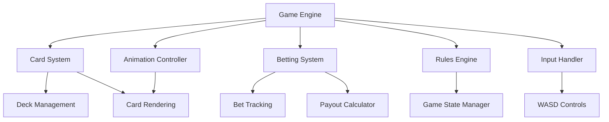

# Damn Simple Blackjack

A minimalist yet engaging blackjack game focused on delivering a streamlined card playing experience.


## Overview

Damn Simple Blackjack is exactly what it sounds like - a straightforward implementation of blackjack that lets players jump right into the action without unnecessary complexity. The game focuses on the classic 6-deck American blackjack ruleset while maintaining a clean, intuitive interface.

## Features

- **Simple Controls**: WASD-based control scheme for all game actions (hit, stay, split, double, insurance, etc.)
- **Realistic Card Animations**: Smooth dealing and card movement animations
- **Adjustable Betting**: Flexible betting options for different play styles
- **Cross-Platform Design**: Initially for PC/Linux with planned mobile support
- **Visually Appealing**: 2D top-down perspective rendered in 3D space for future graphical enhancements

## Game Rules

The game implements standard American blackjack rules with 6 decks:
- Dealer stands on soft 17
- Blackjack pays 3:2
- Double down allowed on any two cards
- Split up to 3 times (except Aces)
- Insurance available when dealer shows an Ace

## Development Roadmap

- [x] Initial concept and design
- [ ] PC/Linux version development
- [ ] Testing and refinement
- [ ] Mobile port
- [ ] Additional "Damn Simple" card games

## Controls

| Action | Key |
|--------|-----|
| Hit | W |
| Stay | S |
| Double Down | A |
| Split | D |
| Insurance | A+W |
| Adjust Bet | A+S |
| Reset/New Game | D+S |

## Architecture



## Installation

```
# Clone the repository
git clone https://github.com/yourusername/damn-simple-blackjack.git

# Navigate to the project directory
cd damn-simple-blackjack

# Run the game (instructions will vary based on final implementation)
```

## Contributing

Contributions are welcome! Please feel free to submit a Pull Request.

## License

This project is licensed under the MIT License - see the LICENSE file for details.

## Future Plans

- Additional card games in the "Damn Simple" series
- Enhanced graphics and animations
- Online multiplayer support
- Tournament mode

---

*Damn Simple Blackjack - Card games without the complexity.*
